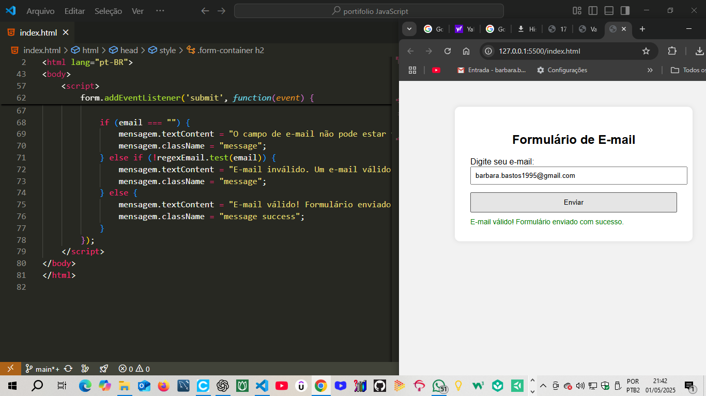
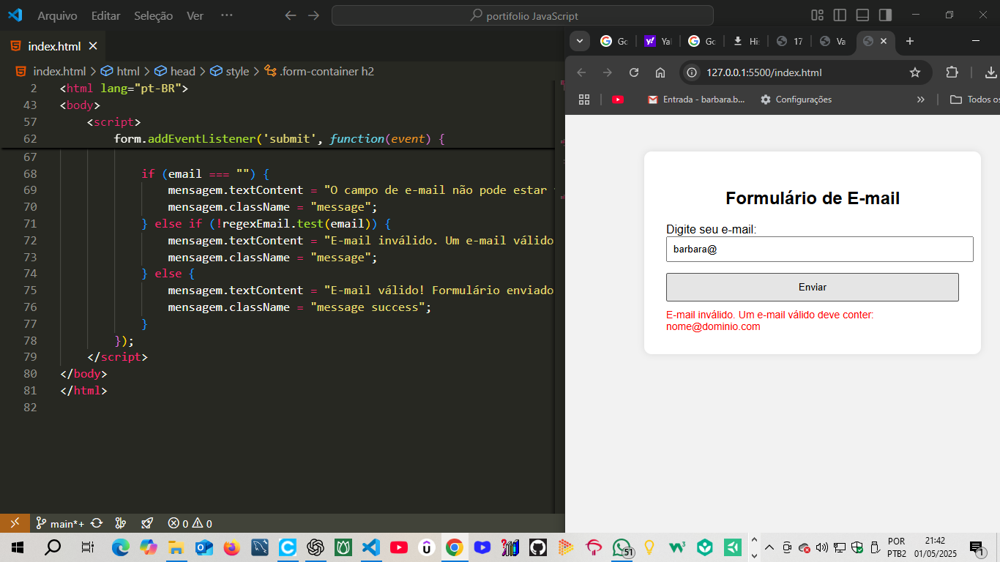

# 🎯 *Validador de E-mail em JavaScript* 🔒

## 🚀 *Sobre o Projeto* 💻

Este é um projeto desenvolvido como parte do meu portfólio e também um exercício prático da faculdade de *Análise e Desenvolvimento de Sistemas (ADS). O objetivo deste projeto é* *validar e-mails* inseridos pelo usuário, garantindo que atendam a um formato específico e sejam válidos para o envio de informações ou cadastro em plataformas.

## 🛠 *Tecnologias Utilizadas* 🔧

- *JavaScript* 🖥
- *HTML5* 🌐
- *CSS3* 🎨

## 🔑 *Objetivo do Projeto* 🎯

A ideia é criar uma *função de validação de e-mails*. O código verifica se o e-mail digitado possui os seguintes requisitos:

- Um *caractere* antes do arroba (@)
- O *arroba (@)* no lugar certo
- Pelo menos *um ponto (.)* após o arroba
- O *domínio* do e-mail (exemplo: "gmail.com")

Caso o e-mail não atenda a esses critérios, ele será considerado *inválido* e o usuário verá uma mensagem informando que o e-mail é *inválido. Caso contrário, ele será considerado* *válido*.

## 📸 *Capturas de Tela* 📸

### ✔ *E-mail Válido*

### ❌ *E-mail Inválido*

## 🧠 *Lógica do Código* 🧩

A função que valida o e-mail segue a lógica:

1. Verifica se o *caractere antes do arroba (@)* existe.
2. Verifica se há *um ponto (.)* após o arroba.
3. Se algum desses critérios não for atendido, o e-mail é *inválido*.
4. Caso contrário, o e-mail é *válido* e uma mensagem de sucesso será exibida.

## 👩‍💻 *Como Usar* 📋

### 1️⃣ Passo a Passo:

1. Abra o arquivo index.html em seu navegador.
2. Digite um e-mail no campo de entrada.
3. Clique no botão *"Validar"*.
4. O resultado será exibido na tela, mostrando se o e-mail é válido ou inválido.

### 2️⃣ *Exemplo de Uso:*

- *E-mail válido:* usuario@gmail.com
- *E-mail inválido:* usuario@gmail..com

## 🔄 *Como Contribuir* 🤝

Este é um projeto open-source, o que significa que você pode contribuir para melhorá-lo! Se você tem ideias de melhorias ou deseja adicionar funcionalidades, fique à vontade para *fazer um fork* e *enviar um pull request*.

### Para contribuir:

1. *Faça o fork* do repositório.
2. Crie uma nova branch com suas alterações.
3. *Adicione as alterações* e faça commit.
4. Envie um pull request para o repositório original.

## 📚 *Sobre Mim* 👩‍💻

Sou *Bárbara, uma estudante de* *Análise e Desenvolvimento de Sistemas* e estou no processo de transição de carreira para a área de tecnologia! 👩‍💻🌟

Tenho experiência de muitos anos no comércio varejista , essa vivência  contibuiu e  muito para minha formação profissional atraves de *soft*  *skills* valiosas. Durante minha trajetória no comércio, aprimorei minha comunicação interpessoal, aprendi a trabalhar bem em equipe, a lidar com pressões diárias, manter o foco em resultados e a ser resiliente diante de desafios. Além disso, desenvolvi uma grande capacidade de resolver problemas, me adaptar rapidamente a mudanças e compreender as necessidades das pessoas com empatia — habilidades essenciais também no mundo da programação.
Aliada a essas *soft skills*, tenho me dedicado com muito empenho ao desenvolvimento das minhas hard skills, como JavaScript, HTML, CSS, entre outras tecnologias essenciais na construção de aplicações web.
 

💡 *Minha motivação* é sempre aprender mais, superar desafios e me tornar uma *profissional qualificada* na área de TI. Estou aberta a novas oportunidades e disposta a crescer profissionalmente!

## 💬 *Entre em Contato* 🌍

- *LinkedIn:* [Meu Perfil no LinkedIn](https://www.linkedin.com/in/barbara-dos-santos-bastos-0080571b6?utm_source=share&utm_campaign=share_via&utm_content=profile&utm_medium=android_app)
- *GitHub:* [Meu Perfil no GitHub](https://github.com/barbarabastossantos)

---

🌟 *Agradeço por visualizar o meu projeto!* 🌟